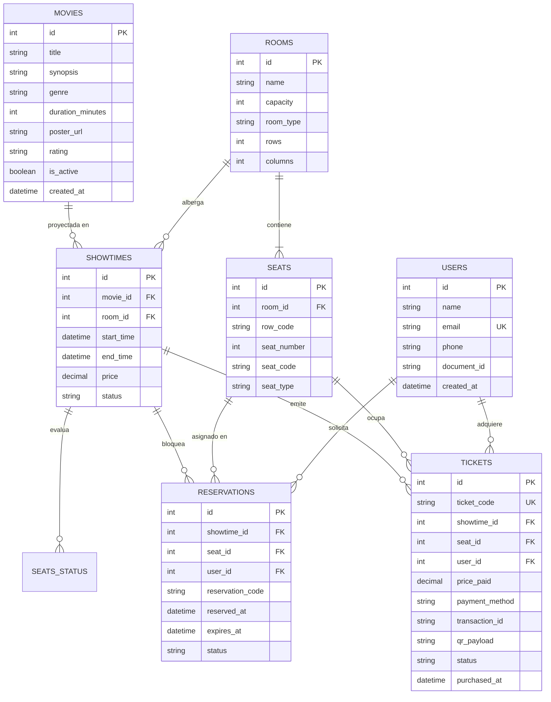
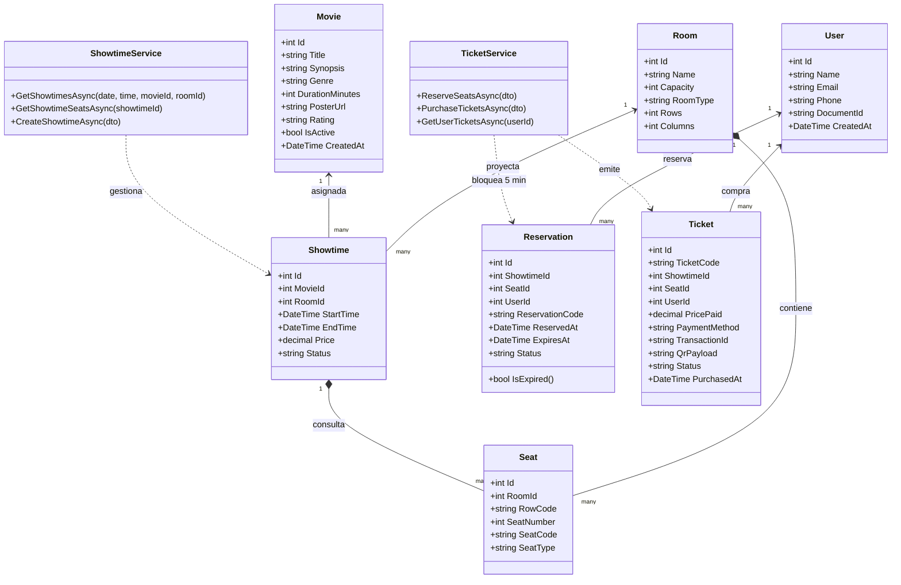
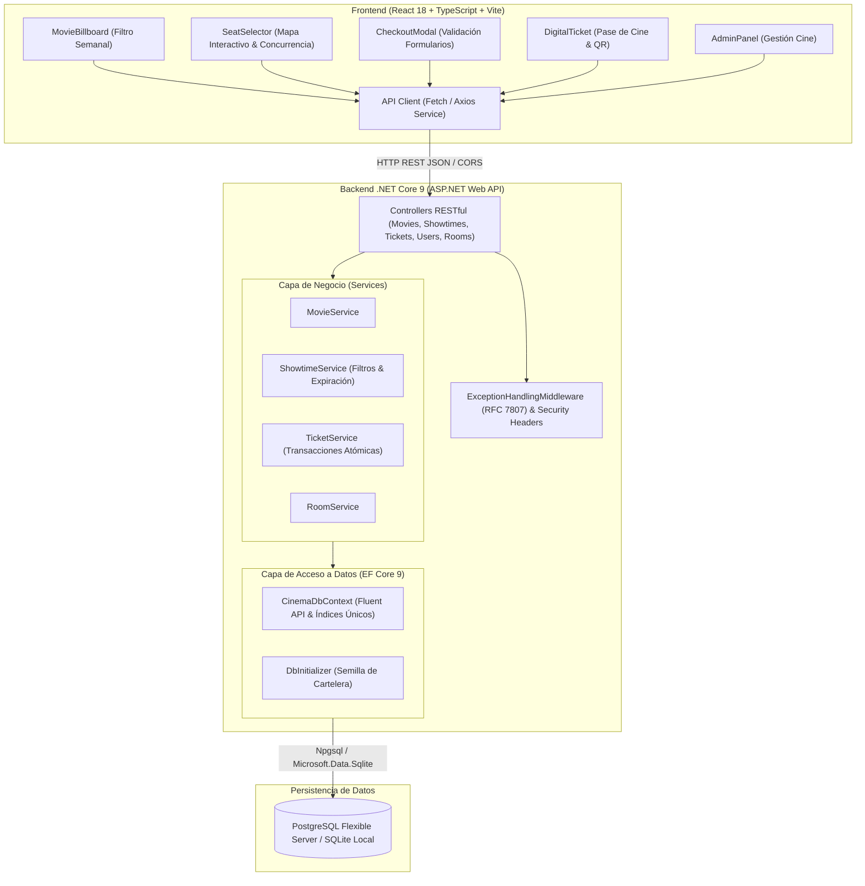
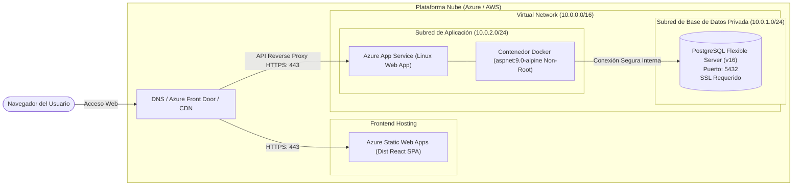

# Diagramas Técnicos de Arquitectura CinePass (Formato Mermaid)

Este documento contiene la especificación visual y técnica de CinePass mediante diagramas Mermaid estandarizados.

---

## 1. Diagrama Entidad-Relación (ER Diagram)

Visualiza las entidades de la base de datos relacional, sus claves primarias, claves foráneas y cardinalidades:

---

## 2. Diagrama de Clases (Class Diagram)

Modela la jerarquía orientada a objetos de la solución .NET Core 9 y sus servicios:

---

## 3. Diagrama de Componentes (Component Diagram)

Estructura de arquitectura limpia de capas lógicas y acoplamiento:

---

## 4. Diagrama de Despliegue (Deployment Diagram)

Arquitectura de infraestructura en la nube aprovisionada con Terraform:

